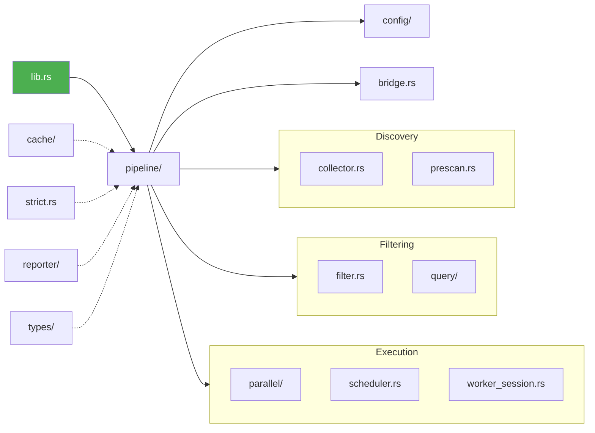
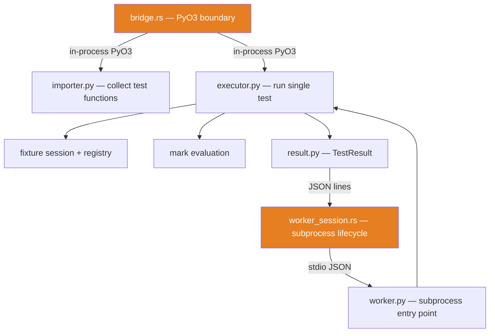

# Architecture Overview

This chapter describes the high-level structure of oxitest: where code lives, why the Rust/Python boundary is drawn where it is, and how the pipeline typestate pattern enforces phase ordering at compile time.

> **Interactive map:** Open the [interactive architecture diagram](../architecture-map.html) for a visual, clickable overview of the pipeline, data structures, and design patterns. Each section links back to the relevant page in these docs.

## Two-layer design

oxitest is split into a **Rust core** (`src/`) and a **Python bridge** (`python/oxitest/_bridge/`). The split follows one rule: anything that can be expressed without importing user code is implemented in Rust; anything that must execute arbitrary Python (importing test modules, calling fixtures, evaluating mark conditions) stays in Python behind a thin PyO3 interface.

### What lives in Rust

- **CLI parsing and configuration** (`config/`) -- clap-based CLI, `pyproject.toml` deserialization, merge logic.
- **File discovery** (`collector.rs`) -- walks the filesystem with `ignore` + `globset`. No Python import required.
- **AST prescan** (`prescan.rs`, `python_ast.rs`) -- parses Python source with `rustpython-parser` to extract test function names, markers, parametrize IDs, and estimated body weights. Files are parsed in parallel via `rayon::par_iter` (CPU-bound, no GIL), then results are accumulated sequentially for deterministic ordering. This enables lazy collection: filtering before Python import.
- **Filtering and grouping** (`filter.rs`) -- query DSL (`-E`) filtering by name, marker, path, etc. Groups items by module for parallel dispatch. Also owns `BUILTIN_MARKERS`.
- **Scheduling** (`scheduler.rs`) -- distributes module groups across workers using timing cache data.
- **Parallel execution** (`parallel/`) -- spawns and manages worker subprocesses, drains JSON results with a per-result watchdog timeout.
- **Caching** (`cache/`) -- timing and outcome persistence in `.oxitest_cache/`. Powers `--lf`/`--ff` and heaviest-first scheduling.
- **Reporting** (`reporter/`) -- TTY progress bars, CI annotations, JSON (CTRF) export, JUnit XML.
- **Strict-mode checking** (`strict.rs`, `bare_asserts.rs`) -- detects code quality violations (bare asserts, dict parametrize, missing mark reasons) entirely from AST.
- **Assert rewriting** (`assert_rewriter.rs`) -- transforms `assert` statements into rich `_OxitestAssertionError` raises via PyO3 AST manipulation.
- **Import graph analysis** (`import_graph.rs`) -- pure-Rust `--affected` dependency resolution via `rustpython-parser`.

### What lives in Python

- **Test module import** (`_bridge/importer.py`) -- imports a test file into the Python runtime, discovers `test_*` functions, returns `CollectedItem` objects.
- **Test execution** (`_bridge/executor.py`) -- resolves fixtures, evaluates parametrize, runs the test function, catches exceptions, returns a `TestResult`.
- **Fixture lifecycle** (`_bridge/_fixture_session.py`, `_bridge/_fixture_registry.py`) -- scope-based caching, yield teardown, autouse injection.
- **Mark evaluation** (`_bridge/_mark_registry.py`, `_bridge/marks.py`) -- evaluates runtime mark conditions (e.g., `skip(when=sys.platform == "win32")`).
- **Worker subprocess** (`_bridge/worker.py`) -- entry point for parallel workers. Reads JSON tasks from stdin, writes JSON result lines to stdout.

### Why this boundary

The boundary maximizes the amount of work that runs in compiled code:

1. **File I/O and globbing** are faster in Rust with zero GIL contention.
2. **AST prescan** avoids importing modules that will be filtered out -- the single biggest performance win in lazy collection. Prescan and metadata filtering both use `rayon` for parallel execution across files.
3. **Parallel orchestration** in Rust avoids the GIL entirely. Workers are separate Python processes communicating over stdio JSON; the Rust side manages the subprocess pool, watchdog timeouts, and result aggregation without holding the GIL.
4. **Reporting** runs in Rust to avoid GIL contention during progress bar updates in parallel mode.

Python is used only where it is unavoidable: executing user test code, resolving fixtures (which may be defined in user conftest files), and evaluating mark conditions that reference arbitrary Python expressions.

## Module map

The following diagram shows the current module structure of the Rust crate. Arrows indicate primary dependency direction (not exhaustive).

### Rust core



### Python bridge



> **Per-file detail** is in the [module reference table](#module-reference-table) below. These diagrams show subsystem-level relationships only.

## Module reference table

Every `.rs` file in `src/`, with its responsibility:

| Module | File path | Responsibility |
|--------|-----------|---------------|
| `lib` | `src/lib.rs` | PyO3 module definition. Exposes `run()`, `rewrite_asserts()`, `builtin_markers()` to Python. |
| **Pipeline** | | |
| `pipeline` | `src/pipeline/mod.rs` | Orchestrator. Defines `Pipeline<S>`, `PipelineShared`, all state types, `setup()`, and command entry points (`run_command`, `debug_command`, `query_command`). |
| `pipeline::phases` | `src/pipeline/phases/mod.rs` | Re-exports the 9 per-state phase modules. |
| `pipeline::phases::empty` | `src/pipeline/phases/empty.rs` | `Pipeline<Empty>` transitions: `collect_files()`. |
| `pipeline::phases::files_collected` | `src/pipeline/phases/files_collected.rs` | `Pipeline<FilesCollected>` transitions: `affected()`, `prescan()`, `session()` (query fast-path). |
| `pipeline::phases::prescanned` | `src/pipeline/phases/prescanned.rs` | `Pipeline<Prescanned>` transitions: `filter_metadata()`. |
| `pipeline::phases::metadata_filtered` | `src/pipeline/phases/metadata_filtered.rs` | `Pipeline<MetadataFiltered>` transitions: `session()`. |
| `pipeline::phases::session_ready` | `src/pipeline/phases/session_ready.rs` | `Pipeline<SessionReady>` transitions: `collect()`. |
| `pipeline::phases::collected` | `src/pipeline/phases/collected.rs` | `Pipeline<Collected>` transitions: `validate()`, `strict_or_skip()`. |
| `pipeline::phases::pre_filter` | `src/pipeline/phases/pre_filter.rs` | `Pipeline<PreFilter>` transitions: `filter()`. |
| `pipeline::phases::ready` | `src/pipeline/phases/ready.rs` | `Pipeline<Ready>` transitions: `execute()`. |
| `pipeline::phases::executed` | `src/pipeline/phases/executed.rs` | `Pipeline<Executed>` transitions: `retry()`, `finalize()`. |
| `pipeline::arrange` | `src/pipeline/arrange.rs` | `ExecutionPlan` value object and `plan_execution()`. Partitions groups into inprocess, arranged (shared fixtures), and parallel. |
| `pipeline::traits` | `src/pipeline/traits.rs` | `ExecutionHarness` trait -- abstraction over serial/parallel execution. |
| `pipeline::collection` | `src/pipeline/collection.rs` | Collection helpers and `CollectionProfile`. |
| `pipeline::execution` | `src/pipeline/execution.rs` | Dispatches test execution based on `ExecutionPlan`. |
| `pipeline::helpers` | `src/pipeline/helpers.rs` | Utility functions (e.g., `env_string()`). |
| **Config** | | |
| `config` | `src/config/mod.rs` | `Config` struct, `Command` enum, `Verbosity`, `WorkerCount`, `find_rootdir()`, `compute_optimal_workers()`. |
| `config::cli` | `src/config/cli.rs` | clap `#[derive(Parser)]` definitions: `OxitestCli`, `RunArgs`, `DebugArgs`, `QueryArgs`, `DebugMode`, `QueryFormat`. |
| `config::pyproject` | `src/config/pyproject.rs` | `PyprojectToml` and `OxitestConfig` serde structs for `[tool.oxitest]`. |
| `config::merge` | `src/config/merge.rs` | `merge_run_args()`, `merge_debug_args()`, `merge_query_args()` -- CLI-over-TOML precedence. |
| **Parallel** | | |
| `parallel` | `src/parallel/mod.rs` | `run_phase_parallel()`, `WorkerResult`, `PhaseResult`. Coordinates worker threads, dispatches scheduler groups, aggregates results. |
| `parallel::pool` | `src/parallel/pool.rs` | `prewarm_workers()`, `kill_pool()`, `PoolGuard` (RAII). Pre-spawns worker subprocesses to overlap Python startup with earlier pipeline stages. |
| `parallel::drain` | `src/parallel/drain.rs` | `drain_worker_results()`, `DrainOutcome`. Per-result watchdog loop with timeout/disconnect handling. |
| **Cache** | | |
| `cache` | `src/cache/mod.rs` | `TestCache` facade, `CacheEntry`. Loads/saves `.oxitest_cache/`. |
| `cache::timing` | `src/cache/timing.rs` | `TimingCache` trait -- per-test duration lookup, group sorting. |
| `cache::outcome` | `src/cache/outcome.rs` | `OutcomeCache` trait -- last-outcome and flaky-count lookup. |
| `cache::module` | `src/cache/module.rs` | `ModuleCache` trait -- per-module item data for lazy revalidation. |
| `cache::serde` | `src/cache/serde.rs` | JSON serialization/deserialization for the cache file. |
| **Reporter** | | |
| `reporter` | `src/reporter/mod.rs` | `Reporter` trait, factory function, re-exports. |
| `reporter::tty` | `src/reporter/tty.rs` | `TtyReporter` -- progress bars, colors, deferred failure output. |
| `reporter::ci` | `src/reporter/ci.rs` | `CiReporter` -- GitHub Actions `::error::` annotations. |
| `reporter::json` | `src/reporter/json.rs` | `JsonReporter` -- CTRF-format JSON output. |
| `reporter::junit` | `src/reporter/junit.rs` | JUnit XML report generation. |
| `reporter::plugin` | `src/reporter/plugin.rs` | `PyPluginReporter` -- delegates to user-supplied Python reporter plugins. |
| `reporter::traits` | `src/reporter/traits.rs` | `Reporter` trait definition, `StandardReporter` helper trait, `ExitVote`. |
| `reporter::parametrize_buffer` | `src/reporter/parametrize_buffer.rs` | `ParametrizeBuffer` -- batches parametrize case output for compact display. |
| `reporter::format/` | `src/reporter/format/` | Formatting helpers: `diagnostic.rs`, `diff.rs`, `suggestions.rs`, `summary.rs`. |
| `reporter::options` | `src/reporter/options.rs` | `ReporterOpts` and `ReporterOptsBuilder`. |
| `reporter::session` | `src/reporter/session.rs` | `ReporterSession` -- session-level timing and metadata. |
| `reporter::bridge` | `src/reporter/bridge.rs` | Reporter-to-Python plugin bridge. |
| `reporter::outcome_fmt` | `src/reporter/outcome_fmt.rs` | `ColorCategory`, `JunitCategory` -- outcome-to-display mapping. |
| `reporter::print` | `src/reporter/print.rs` | Shared print helpers (`print_collected`, `print_strict_abort`). |
| `reporter::stats` | `src/reporter/stats.rs` | Outcome counting and summary statistics. |
| `reporter::tracing_writer` | `src/reporter/tracing_writer.rs` | `PbMakeWriter` -- routes `tracing` output through the progress bar. |
| **Query DSL** | | |
| `query` | `src/query/mod.rs` | Query subsystem entry point and `needs_python()`. |
| `query::ast` | `src/query/ast.rs` | Query DSL AST nodes. |
| `query::compile` | `src/query/compile.rs` | Query DSL compiler (text to AST). |
| `query::eval` | `src/query/eval.rs` | Query DSL evaluator. |
| `query::extract` | `src/query/extract.rs` | Extracts queryable attributes from test items. |
| `query::format` | `src/query/format.rs` | Formats query results for display. |
| `query::fzf` | `src/query/fzf.rs` | Fuzzy matching support. |
| `query::highlight` | `src/query/highlight.rs` | Syntax highlighting for query expressions. |
| `query::inspect` | `src/query/inspect.rs` | Introspection of query predicates. |
| `query::resource` | `src/query/resource.rs` | `ResourceKind` enum and `QueryEntry`. |
| `query::bridge` | `src/query/bridge.rs` | Query-to-Python bridge for fixture/plugin introspection. |
| **AST + Prescan** | | |
| `python_ast` | `src/python_ast.rs` | `parse_file()`, `is_test_fn()` -- shared AST utilities for `rustpython-parser`. |
| `prescan` | `src/prescan.rs` | `PrescanItem`, `PrescanMarker`, `PrescanResult`. AST-based metadata extraction for lazy collection. |
| `doctest` | `src/doctest.rs` | `DoctestExample` -- extracts `>>>` interactive examples from docstrings. |
| `import_graph` | `src/import_graph.rs` | Pure-Rust import graph analysis for `--affected`. |
| `bare_asserts` | `src/bare_asserts.rs` | Pure-Rust bare-assert detection for strict mode. |
| **Core types and services** | | |
| `types` | `src/types/mod.rs` | `NodeId`, `TestItem`, `TestOutcome`, `DurationMs`, `TestTiming`, `CollectError`, `ExitCode`. |
| `bridge` | `src/bridge.rs` | PyO3 boundary: `TestResult`, `CollectedItem`, `RawViolation`, `FixtureSession`. Data contracts that must stay in sync with `python/oxitest/_bridge/result.py`. |
| `filter` | `src/filter.rs` | `BUILTIN_MARKERS`, `validate_markers()`, keyword/marker filtering, module grouping. |
| `collector` | `src/collector.rs` | Filesystem walk for test files and conftest files. |
| `scheduler` | `src/scheduler.rs` | `apply_schedule_strategy()` -- sorts groups by timing, failure status, or round-robin. |
| `strict` | `src/strict.rs` | `StrictViolation` -- strict-mode violation types and classification. |
| `worker_session` | `src/worker_session.rs` | `WorkerParams`, `setup_worker_process()`, `spawn_worker()` -- subprocess lifecycle and I/O. |
| `worker_result` | `src/worker_result.rs` | `WorkerTask`, `WireResult`, `WorkerOutcome`, `RawFrame` -- JSON wire protocol types. |
| `assert_rewriter` | `src/assert_rewriter.rs` | Transforms `assert` statements into `_OxitestAssertionError` raises via PyO3 AST manipulation. |
| `retry` | `src/retry.rs` | Re-runs failed tests serially up to N times. Tests that pass on retry are marked flaky. |
| `affected` | `src/affected.rs` | `--affected` git-aware test selection. Classifies changed files and filters test list. |
| `colors` | `src/colors.rs` | Terminal color helper macros, shared across reporter and query. |
| `edit_distance` | `src/edit_distance.rs` | Levenshtein distance for "did you mean?" suggestions. |
| `parallel_context` | `src/parallel_context.rs` | `ParallelContext` -- worker ID and concurrent test list attached to failure output. |

## Pipeline typestate

The pipeline uses a **typestate pattern** to enforce phase ordering at compile time. `Pipeline<S>` is generic over a state type `S`; each state implements only the transitions that are valid from that state. Calling transitions in the wrong order is a compile error -- there is no runtime phase tracking.

### State types

All state types are defined in `src/pipeline/mod.rs`:

| State | Holds | Transition |
|-------|-------|-----------|
| `Empty` | Nothing | `collect_files()` |
| `FilesCollected` | `test_files`, `conftest_files` | `affected()`, `prescan()`, `session()` (query path) |
| `Prescanned` | prescan data + module markers | `filter_metadata()` |
| `MetadataFiltered` | `modules_to_import`, pruned conftest chain | `session()` |
| `SessionReady` | `FixtureSession`, violations | `collect()` |
| `Collected` | `Vec<Arc<TestItem>>`, violations | `validate()`, `strict_or_skip()` |
| `PreFilter` | clean + violated items, suite lines | `filter()` |
| `Ready` | final filtered items | `execute()` |
| `Executed` | `ExecutionResults`, timings | `retry()`, `finalize()` |

### PipelineShared and Deref

`Pipeline<S>` holds two fields: `shared: PipelineShared` and `state: S`. `PipelineShared` contains data that lives across all states -- the `Config`, `TestCache`, root directory, reporter options, and the resolved Python binary path.

`Pipeline<S>` implements `Deref<Target = PipelineShared>` and `DerefMut`, so phase methods can access shared fields directly through `self` without `self.shared.`:

```rust
pub(crate) struct Pipeline<S> {
    pub(crate) shared: PipelineShared,
    pub(crate) state: S,
}

impl<S> std::ops::Deref for Pipeline<S> {
    type Target = PipelineShared;
    fn deref(&self) -> &PipelineShared {
        &self.shared
    }
}
```

### Compile-time enforcement

Each transition consumes `Pipeline<CurrentState>` and produces `Result<Pipeline<NextState>, ExitCode>`. The consuming move means the old state is gone -- you cannot accidentally use a pipeline in the wrong state:

```rust
// In src/pipeline/phases/empty.rs
impl Pipeline<Empty> {
    pub(crate) fn collect_files(self) -> Result<Pipeline<FilesCollected>, ExitCode> {
        // ... discovers files ...
    }
}
```

A call like `pipeline.prescan()` on a `Pipeline<Empty>` would fail to compile because `Pipeline<Empty>` has no `prescan()` method -- only `Pipeline<FilesCollected>` does.

### The run chain

The `run_command()` function in `src/pipeline/mod.rs` shows the full chain:

```rust
fn run_command(py: Python<'_>, pipeline: Pipeline<Empty>) -> Result<ExitCode, ExitCode> {
    let p = pipeline.collect_files()?;
    let p = p.affected()?;
    let p = p.prescan()?;
    let p = p.filter_metadata()?;
    let p = p.session(py)?;
    let p = p.collect(py)?;
    let p = p.validate(py)?;
    let p = p.strict_or_skip(py)?;
    let p = p.filter(py)?;
    let p = p.execute(py)?;
    let p = p.retry(py)?;
    let result = p.finalize(py);
    result
}
```

Each `let p = ...` rebinds `p` to a new type. The compiler verifies the entire chain at build time. Alternative command paths (debug, query) use different subsets of the same transitions.
