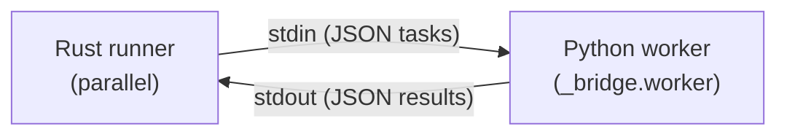

# Worker Protocol

## Overview

When oxitest runs tests in parallel, the Rust scheduler spawns one or more persistent
Python worker subprocesses. Each worker receives test tasks via **stdin** and emits
results via **stdout**, using newline-delimited JSON.



**Spawn command:** `python -m oxitest._bridge.worker`

- stdin: piped (Rust writes tasks)
- stdout: piped (Rust reads results)
- stderr: inherited (Python tracebacks visible to user)

## Lifecycle

1. Rust spawns the worker subprocess
2. Worker enters a read loop on stdin
3. For each newline-delimited JSON task, the worker executes all items and writes one result line per test to stdout
4. When stdin reaches EOF (Rust closes the pipe), the worker exits cleanly
5. Rust calls `child.wait()` to reap the process

Workers are **persistent** — one subprocess handles multiple module groups sequentially.
This amortizes Python interpreter startup cost across many tests.

## Task Schema (stdin)

Each line on stdin is a JSON object:

```json
{
    "module_path": "tests/test_math.py",
    "items": [
        {"fn_name": "test_add", "param_id": null},
        {"fn_name": "test_mul", "param_id": "x0"}
    ],
    "conftest_paths": ["tests/conftest.py", "conftest.py"],
    "timeout_secs": 30,
    "keep_tmp": "failed",
    "show_locals": true,
    "show_internals": false
}
```

| Field | Type | Description |
|-------|------|-------------|
| `module_path` | string | Relative path to the test module file |
| `items` | array | Test functions to execute in this module |
| `items[].fn_name` | string | Function name within the module |
| `items[].param_id` | string \| null | Parametrize case ID (e.g. `"x0"`) or null |
| `conftest_paths` | array of strings | Conftest files to load for fixture resolution |
| `timeout_secs` | int \| null | Per-test timeout in seconds, or null for no timeout |
| `keep_tmp` | `string \| null` | Optional. `"failed"`, `"always"`, or omitted. Controls TempDir preservation. |
| `show_locals` | `bool \| null` | Optional. When `true`, worker captures local variables in traceback frames. |
| `show_internals` | `bool \| null` | Optional. When `true`, worker includes internal (oxitest) frames in tracebacks. |

## Result Schema (stdout)

For each test item, the worker writes exactly one JSON line to stdout:

```json
{
    "node_id": "tests/test_math.py::test_add",
    "outcome": "passed",
    "duration_ms": 12.5,
    "failure_repr": null,
    "message": null,
    "file": null,
    "lineno": null,
    "source_line": null,
    "no_message_lines": [],
    "left": null,
    "right": null,
    "op": null,
    "strict": false,
    "frames": [],
    "field_diffs": [["name", "\"alice\"", "\"Alice\""]],
    "protocol_version": 1
}
```

| Field | Type | Description |
|-------|------|-------------|
| `node_id` | string | Full test identifier: `module_path::fn_name[param_id]` |
| `outcome` | string | Test result status (see below) |
| `duration_ms` | float | Wall-clock execution time in milliseconds |
| `failure_repr` | string \| null | Human-readable failure summary (for skipped/xfailed/timeout/warned) |
| `message` | string \| null | Primary diagnostic message (assertion message, error text) |
| `file` | string \| null | Source file where the failure occurred |
| `lineno` | int \| null | Line number of the failure |
| `source_line` | string \| null | Source code at the failure line |
| `no_message_lines` | array of int | Line numbers of bare assert statements (no message) |
| `left` | string \| null | Left operand repr for comparison assertions |
| `right` | string \| null | Right operand repr for comparison assertions |
| `op` | string \| null | Comparison operator (e.g. `"=="`, `"!="`, `"in"`) |
| `strict` | bool | Whether the test was in strict xfail mode |
| `frames` | `array \| null` | Optional. Stack frames for failures. Each frame has `file`, `lineno`, `name`, `line`, and optionally `locals` (array of `[name, repr]` pairs when `show_locals` is enabled). |
| `field_diffs` | `array \| null` | Optional. Per-field diffs for dataclass comparisons. Each entry is `[field_name, left_value, right_value]`. |
| `protocol_version` | `int` | Wire format version (currently `1`). The coordinator warns once per drain call on version mismatch. |

## Outcome Values

| Value | Meaning |
|-------|---------|
| `passed` | Test completed successfully |
| `failed` | Assertion failed |
| `error` | Unexpected exception (not AssertionError) |
| `skipped` | Test was skipped (via `skip()` or `@mark.skip`) |
| `xfailed` | Expected failure occurred |
| `xpassed` | Expected failure did NOT occur (unexpected pass) |
| `warned` | Test passed but emitted warnings |
| `timeout` | Test exceeded the configured timeout |
| `flaky` | Test failed initially but passed on retry |

## Error Handling

### Malformed JSON from worker

If the Rust side receives a line that doesn't parse as valid JSON, it logs a warning
and counts it as a received result (to maintain the expected count), but does not
forward it to the reporter. The watchdog deadline is still reset.

### Subprocess crash

If the worker process exits unexpectedly (stdout disconnects before all results arrive),
Rust synthesizes `WorkerResult::crashed()` for each remaining test item in the group.
These appear as `"error"` outcomes with message "Worker subprocess exited unexpectedly".

### Watchdog timeout

Each worker has a per-result watchdog deadline:

- **With `timeout_secs` configured:** `timeout_secs + 30s` grace period
- **Without timeout:** 10-minute cap

If no result line arrives within the deadline, Rust kills the subprocess and synthesizes
`WorkerResult::timed_out()` for remaining items. Empty lines (blank stdout output) do
**not** reset the deadline — only real result lines do.

### Remaining unprocessed groups

If all workers crash before the scheduler is drained, any groups still queued are
reported as crashed errors via `drain_remaining_into_crashed()`.

## Protocol Invariants

1. **One result per item:** For N items in a task, the worker MUST write exactly N result lines
2. **Order matches input:** Results are emitted in the same order as `items` in the task
3. **No interleaving:** One task is fully processed before the next is read from stdin
4. **Newline-delimited:** Each JSON object is on its own line (no pretty-printing)
5. **Stdout only:** Results go to stdout; diagnostic output (tracebacks, prints) goes to stderr

## How to add a new field to the wire format

### Adding a field to the task (Rust -> worker)

The task schema is defined by `WorkerTask` and `WorkerTaskItem` in `src/worker_result.rs`.
These structs derive `serde::Serialize` and are written as JSON to the worker's stdin.

```rust
#[derive(serde::Serialize)]
pub(crate) struct WorkerTask<'a> {
    pub module_path: &'a str,
    pub items: Vec<WorkerTaskItem<'a>>,
    pub conftest_paths: &'a serde_json::value::RawValue,
    pub timeout_secs: Option<u64>,
    #[serde(skip_serializing_if = "Option::is_none")]
    pub keep_tmp: Option<&'a str>,
    #[serde(skip_serializing_if = "Option::is_none")]
    pub show_locals: Option<bool>,
    #[serde(skip_serializing_if = "Option::is_none")]
    pub show_internals: Option<bool>,
}

#[derive(serde::Serialize)]
pub(crate) struct WorkerTaskItem<'a> {
    pub fn_name: &'a str,
    pub param_id: Option<&'a str>,
    pub node_id: &'a str,
    pub markers: &'a [String],
}
```

Steps:

1. Add the field to `WorkerTask` or `WorkerTaskItem` in `src/worker_result.rs`.
   Use `#[serde(skip_serializing_if = "Option::is_none")]` if the field is optional,
   so older workers that do not expect it receive compact JSON.

2. Populate the field in `run_worker_loop()` in `src/worker_session.rs`, where tasks
   are constructed from the `WorkerParams` struct and the scheduler's module groups.

3. Read the field in the Python worker (`python/oxitest/_bridge/worker.py`).
   Use `.get("field_name", default)` for backwards compatibility with older
   coordinators that may not send the field.

### Adding a field to results (worker -> Rust)

The result schema is defined by `WireResult` in `src/worker_result.rs` (deserialized
by `serde`) and produced by `TestResult.to_wire()` in `python/oxitest/_bridge/result.py`.

```rust
#[derive(Debug, serde::Deserialize)]
pub(crate) struct WireResult {
    pub node_id: String,
    pub outcome: types::OutcomeKind,
    pub duration_ms: f64,
    #[serde(default)]
    pub protocol_version: u32,
    #[serde(default)]
    pub failure_repr: Option<String>,
    #[serde(default)]
    pub message: Option<String>,
    #[serde(default)]
    pub file: Option<String>,
    #[serde(default)]
    pub lineno: Option<u64>,
    // ... additional optional fields ...
}
```

Steps:

1. Add the field to `TestResult` in `python/oxitest/_bridge/result.py` with a
   default value. If the field should be sent over the wire, make sure it is not
   in `_WIRE_EXCLUDE_ATTRS` (or handle it explicitly in `to_wire()`).

2. Add the field to `WireResult` in `src/worker_result.rs`. **Always** use
   `#[serde(default)]` so that messages from older workers (which omit the field)
   still deserialize:

   ```rust
   #[serde(default)]
   pub new_field: Option<String>,
   ```

3. Wire the field through `WireResult::into_worker_outcome()` into the appropriate
   `WorkerOutcome` variant. Then update `From<WorkerOutcome> for TestOutcome` if
   the field affects the domain.

4. If the field is also used by the in-process PyO3 path (serial execution), add
   it to the `TestResult` struct in `src/bridge.rs` and handle it in
   `convert_test_result()`.

### Backwards compatibility

- Use `#[serde(default)]` on every new `WireResult` field so older workers work.
- Use `#[serde(skip_serializing_if = "Option::is_none")]` on new `WorkerTask` fields.
- The `PROTOCOL_VERSION` constant (currently `1`) in both `src/worker_result.rs` and
  `python/oxitest/_bridge/result.py` should be bumped when adding, removing, or
  renaming wire fields.

## Worker pre-warming

### Problem

Python interpreter startup takes 100-200ms. In a parallel run with 4-8 workers,
this means 100-200ms of idle time at the start while all workers boot up.

### Solution: `prewarm_workers()`

After the pipeline decides to run in parallel and computes the optimal worker count,
it immediately spawns all worker subprocesses via `prewarm_workers()` in
`src/parallel/pool.rs`:

```rust
pub(crate) fn prewarm_workers(python_bin: &str, count: usize) -> Vec<PrewarmedWorker> {
    (0..count)
        .filter_map(|_| crate::worker_session::setup_worker_process(python_bin))
        .collect()
}
```

Each `PrewarmedWorker` is a tuple of `(Child, BufWriter<ChildStdin>, Receiver<String>)` --
the subprocess handle, its stdin writer, and the stdout line receiver. The workers are
spawned but idle: they block on `sys.stdin.readline()` waiting for their first task.

While the workers are starting up, the pipeline continues with fixture arrangement,
in-process serial tests, and other setup work. By the time parallel execution begins,
the workers' Python interpreters have finished initialization and are ready to
receive tasks immediately.

### PoolGuard RAII

The pre-warmed workers are held in a `PoolGuard` struct that implements `Drop`:

```rust
pub(crate) struct PoolGuard {
    workers: Vec<PrewarmedWorker>,
}

impl Drop for PoolGuard {
    fn drop(&mut self) {
        if !self.workers.is_empty() {
            kill_pool(std::mem::take(&mut self.workers));
        }
    }
}
```

`PoolGuard` ensures cleanup in all exit paths:

- **Normal path:** `guard.take()` moves the workers out before drop, passing them
  to `run_phase_parallel()`. The guard's drop is then a no-op.
- **Early return / error:** If the pipeline returns early (e.g. all tests filtered
  out, or a serial-phase failure triggers maxfail), dropping the guard automatically
  kills all pre-warmed workers. No manual cleanup needed.

### Lifecycle summary

1. `prewarm_workers(python_bin, count)` spawns `count` subprocesses
2. Workers are wrapped in a `PoolGuard`
3. Pipeline does fixture arrangement and serial work (workers are booting concurrently)
4. `guard.take()` extracts workers, passes them to `run_phase_parallel()`
5. `spawn_worker_with_process()` wraps each pre-warmed worker in a thread with `run_worker_loop()`
6. Excess workers (if fewer needed than spawned) are killed via `kill_pool()`
7. On drop, `PoolGuard` kills any workers that were not taken

## WorkerParams

`WorkerParams` bundles the parameters shared across all worker threads. Before its
introduction, `spawn_worker()` took 11 positional arguments -- making call sites
fragile and hard to read. The named struct in `src/worker_session.rs` replaces them:

```rust
pub(crate) struct WorkerParams {
    pub worker_id: usize,
    pub sched: Arc<scheduler::Scheduler>,
    pub cancelled: Arc<AtomicBool>,
    pub conftest_json: Arc<serde_json::value::RawValue>,
    pub timeout_secs: Option<u64>,
    pub keep_tmp: Option<Arc<str>>,
    pub show_locals: bool,
    pub show_internals: bool,
    pub tx: crossbeam_channel::Sender<WorkerResult>,
    pub in_flight: Arc<Mutex<AHashSet<String>>>,
}
```

| Field | Purpose |
|-------|---------|
| `worker_id` | Zero-indexed worker identity, used in `WorkerResult` for reporter display |
| `sched` | Shared scheduler; workers call `sched.pop()` to claim module groups |
| `cancelled` | Shared flag; set when maxfail is reached to stop all workers |
| `conftest_json` | Pre-serialized conftest paths (as `RawValue` to avoid re-serialization per task) |
| `timeout_secs` | Per-test timeout from config; `None` means no timeout |
| `keep_tmp` | TempDir preservation mode (`"failed"`, `"always"`, or `None`) |
| `show_locals` | Whether to capture local variables in traceback frames |
| `show_internals` | Whether to include oxitest-internal frames in tracebacks |
| `tx` | Channel sender for completed `WorkerResult` items |
| `in_flight` | Shared set of currently-executing node IDs (for concurrent test reporting) |

Both `spawn_worker()` (spawns its own subprocess) and `spawn_worker_with_process()`
(accepts a pre-warmed subprocess) delegate to `run_worker_loop()`, which destructures
`WorkerParams` and drives the task dispatch loop.

## See also

- [Architecture Overview](architecture.md) -- where worker code lives in the codebase
- [PyO3 Bridge Contract](bridge.md) -- the in-process PyO3 data contract
- [Extending oxitest](extending.md) -- how to add new fields to the wire format
