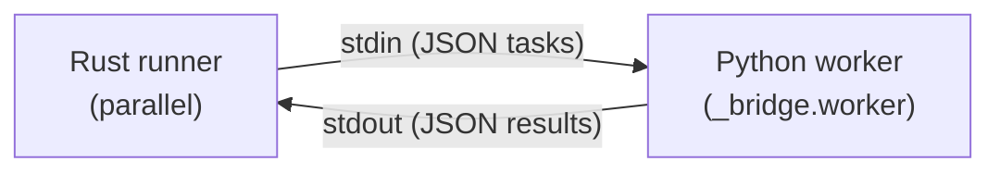

# Worker Protocol

## Overview

When oxitest runs tests in parallel, the Rust scheduler spawns one or more persistent
Python worker subprocesses. Each worker receives test tasks via **stdin** and emits
results via **stdout**, using newline-delimited JSON.

> **User guide:** See [Running Tests in Parallel](../../site/how-to/run-in-parallel/) for how to configure and use parallel execution.



**Spawn command:** `python -m oxitest._bridge.worker`

- stdin: piped (Rust writes tasks)
- stdout: piped (Rust reads results)
- stderr: inherited (Python tracebacks visible to user)

### Encoding

**Every byte on all three streams is UTF-8, on every platform.**

This is a property of the protocol, not of the host. Rust writes tasks with
`serde_json::to_writer`, which does not escape non-ASCII — a path containing
`ü` goes down the pipe as raw UTF-8. Rust reads results with
`BufRead::read_line` into a `String`, which rejects anything that is not valid
UTF-8 and, at `src/worker_session.rs`, treats that read error the same as EOF.

Python does not honour this by default. A worker's `sys.stdin`, `sys.stdout`
and `sys.stderr` fall back to the locale codec, which on Windows is cp1252, so
`worker.py:main()` calls `force_utf8_streams()` before its first read.
Without it a non-ASCII path decodes to mojibake, every result comes back under
a node id the coordinator never issued, `parallel::drain` discards all of them,
and the run reports `no tests ran` with exit code 0 (#2004).

Two consequences worth keeping in mind when changing this code:

- The declaration must precede the first read. `TextIOWrapper.reconfigure`
  raises `UnsupportedOperation` once a stream has been read from.
- Worker→Rust stdout survives independently of that, because `_emit` uses
  `json.dumps`'s `ensure_ascii=True` default and so emits pure ASCII. That is
  a second line of defence, not a redundant one — do not disable it for
  payload size without re-checking the `read_line` path above.

## Lifecycle

1. Rust spawns the worker subprocess
2. Worker enters a read loop on stdin
3. For each newline-delimited JSON task, the worker executes all items and writes one result line per test to stdout
4. When stdin reaches EOF (Rust closes the pipe), the worker exits cleanly
5. Rust calls `child.wait()` to reap the process

Workers are **persistent** — one subprocess handles multiple module groups sequentially.
This amortizes Python interpreter startup cost across many tests.

## Message Envelope

Starting with wire protocol v3, every LDJSON line the worker writes to stdout carries a top-level `"type"` discriminator. The Rust coordinator deserializes an envelope first (`WireEnvelope` in `src/worker_result/wire.rs`) and routes the full line to the correct payload type based on the `"type"` value:

| `"type"` value | Payload struct | Purpose |
|----------------|----------------|---------|
| `"result"` | `WireResult` | Per-test outcome (see [Result Schema](#result-schema-stdout)) |
| `"diagnostic"` | `WireDiagnostic` | User-facing message (severity, context, message, optional file/lineno) surfaced via the reporter summary block |
| `"trace"` | `WireTrace` | Developer log event (level, module, message) routed to Rust's `tracing` crate; gated by `RUST_LOG` |

Missing or unknown `"type"` values default to `"result"` for backwards compatibility with pre-v3 workers (see `default_result_type()` in `wire.rs`).

**Diagnostic payload** (`{"type": "diagnostic", ...}`):

| Field | Type | Description |
|-------|------|-------------|
| `severity` | string | `"error"`, `"warning"`, or `"notice"` |
| `context` | string | Short label (e.g. `"fixture teardown"`) |
| `message` | string | Human-readable diagnostic body |
| `file` | string | Optional. Source file, empty if not applicable |
| `lineno` | int | Optional. Source line, 0 if not applicable |

**Trace payload** (`{"type": "trace", ...}`):

| Field | Type | Description |
|-------|------|-------------|
| `level` | string | `"error"`, `"warn"`, `"info"`, `"debug"`, or `"trace"` |
| `module` | string | Rust module name for the trace target |
| `message` | string | Log message body |

The coordinator's per-result watchdog deadline resets on each real line regardless of `"type"`, so diagnostic and trace lines keep the worker "alive" from the deadline's perspective.

## Task Schema (stdin)

Each line on stdin is a JSON object. Every task must carry `protocol_version`,
and the worker refuses a task that omits it — see [Version
mismatch](#version-mismatch). It is left out of the example below only so the
example stays about the task shape; `PROTOCOL_VERSION` gives its value.

```json
{
    "modules": [
        {
            "module_path": "tests/test_math.py",
            "items": [
                {"fn_name": "test_add", "param_id": null,
                 "node_id": "tests/test_math.py::test_add", "markers": []},
                {"fn_name": "test_mul", "param_id": "x0",
                 "node_id": "tests/test_math.py::test_mul[x0]", "markers": ["slow"]}
            ]
        }
    ],
    "fixture_modules": [{"module": "tests/__fixtures__.py", "anchor": "tests"}],
    "plugins": {"modules": [], "settings": {}},
    "timeout_secs": 30,
    "keep_tmp": "failed",
    "rootdir": "/path/to/project",
    "show_locals": true,
    "show_internals": false
}
```

| Field | Type | Description |
|-------|------|-------------|
| `protocol_version` | int | Wire format version — `PROTOCOL_VERSION` in `src/worker_result/wire.rs` and `python/oxitest/_bridge/result.py` declares it. The worker **rejects** a task whose version it does not speak, or one carrying no version at all, exiting nonzero after emitting an `error` diagnostic. See [Version mismatch](#version-mismatch). |
| `modules` | array | Modules to execute in this task |
| `modules[].module_path` | string | Relative path to the test module file |
| `modules[].items` | array | Test functions to execute in that module |
| `modules[].items[].fn_name` | string | Function name within the module |
| `modules[].items[].param_id` | string \| null | Parametrize case ID (e.g. `"x0"`) or null |
| `modules[].items[].node_id` | string | Full test identifier: `module_path::fn_name[param_id]` |
| `modules[].items[].markers` | array of strings | Marker names applied to this item |
| `fixture_modules` | array | Fixture declaration modules to import, each `{"module", "anchor"}` — the anchor is the B1 boundary the declaration is scoped to |
| `plugins` | object | The run's plugins: `{"modules": [str], "settings": {str: {str: any}}}`. A worker activates these before it registers fixture modules |
| `timeout_secs` | int \| null | Per-test timeout in seconds, or null for no timeout |
| `keep_tmp` | `string \| null` | Optional. `"failed"`, `"always"`, or omitted. Controls TempDir preservation. |
| `rootdir` | string | Project rootdir, appended to the worker's `sys.path` so test modules can import sibling utility modules (#1780). |
| `show_locals` | `bool \| null` | Optional. When `true`, worker captures local variables in traceback frames. |
| `show_internals` | `bool \| null` | Optional. When `true`, worker includes internal (oxitest) frames in tracebacks. |

A task carries a **list** of modules. The coordinator sends exactly one per task
today; [#1710](https://github.com/kalonji-tools/oxitest/issues/1710) makes a
package's whole subtree a single task, so a package-lifetime fixture is
instantiated exactly once per run.

Items nest under their module rather than each carrying a `module_path`. A flat
list would make item *ordering* load-bearing: the worker would have to detect
module transitions to know where `end_module` fires.

### Version mismatch

Results carry `protocol_version` too, but the two directions fail differently:

| Direction | Behaviour |
|-----------|-----------|
| Coordinator → worker (task) | **Fail closed.** The worker emits an `error` diagnostic naming both versions and `just build`, then exits nonzero. |
| Worker → coordinator (result) | **Warn and continue.** `parallel/drain.rs` logs a mismatch once per drain call and still forwards the result. |

The task direction is stricter because it has no fallback: a worker that cannot
parse the task emits no result line at all, so the result-side warning never
fires and the coordinator sees only a dead subprocess.

## Result Schema (stdout)

Result lines are one message type in the wire envelope — see [Message Envelope](#message-envelope) for the full dispatch scheme.

For each test item, the worker writes exactly one JSON line to stdout. The `outcome`
field determines which additional fields are present -- each outcome carries only its
relevant fields (compact JSON, falsy fields omitted).

**Common fields** (present on every outcome):

| Field | Type | Description |
|-------|------|-------------|
| `node_id` | string | Full test identifier: `module_path::fn_name[param_id]` |
| `outcome` | string | Test result status -- drives variant selection (see below) |
| `duration_ms` | float | Wall-clock execution time in milliseconds |
| `protocol_version` | int | Wire format version — `PROTOCOL_VERSION` in `src/worker_result/wire.rs` and `python/oxitest/_bridge/result.py` declares it. The coordinator warns once per drain call on mismatch. |

**Per-outcome fields:**

| Outcome | Fields | Description |
|---------|--------|-------------|
| `passed` | `no_message_lines` | Line numbers of bare `print()` calls in the test body |
| `failed` | `message`, `file`, `lineno`, `source_line`, `left`, `right`, `op`, `frames`, `field_diffs` | Full assertion diagnostic |
| `error` | `message`, `file`, `lineno`, `source_line`, `frames` | Unhandled exception diagnostic (no comparison fields) |
| `skipped` | `message` | Skip reason |
| `xfailed` | `message` | Expected-failure reason |
| `xpassed` | `strict` | Whether the xfail was strict mode |
| `warned` | `message`, `no_message_lines` | Warning text and print() line numbers |
| `timeout` | `message` | Timeout description |

**Examples.** Every result line carries `protocol_version`; it is omitted here so
the examples stay about the per-outcome field sets.

```json
{"node_id": "tests/test_math.py::test_add", "outcome": "passed", "duration_ms": 12.5}
```

```json
{"node_id": "tests/test_math.py::test_div", "outcome": "failed", "duration_ms": 3.1,
 "message": "assert 1 / 0", "file": "tests/test_math.py", "lineno": 8, "source_line": "assert 1 / 0 == 0",
 "left": "ZeroDivisionError", "right": "0", "op": "=="}
```

```json
{"node_id": "tests/test_net.py::test_fetch", "outcome": "skipped", "duration_ms": 0.1,
 "message": "needs network"}
```

**Diagnostic field reference:**

| Field | Type | Present on | Description |
|-------|------|------------|-------------|
| `message` | string | failed, error, skipped, xfailed, warned, timeout | Primary diagnostic or reason text |
| `file` | string | failed, error | Source file where the failure occurred |
| `lineno` | int | failed, error | Line number of the failure |
| `source_line` | string | failed, error | Source code at the failure line |
| `no_message_lines` | array of int | passed, warned | Line numbers of bare `print()` statements |
| `left` | string | failed | Left operand repr for comparison assertions |
| `right` | string | failed | Right operand repr for comparison assertions |
| `op` | string | failed | Comparison operator (e.g. `"=="`, `"!="`, `"in"`) |
| `strict` | bool | xpassed | Whether the test was in strict xfail mode |
| `frames` | array | failed, error | Stack frames. Each frame has `file`, `lineno`, `name`, `line`, and optionally `locals` (array of `[name, repr]` pairs when `show_locals` is enabled). |
| `field_diffs` | array | failed | Per-field diffs for dataclass comparisons. Each entry is `[field_name, left_value, right_value]`. |

## Outcome Values

| Value | Meaning |
|-------|---------|
| `passed` | Test completed successfully |
| `failed` | Assertion failed |
| `error` | Unexpected exception (not AssertionError) |
| `skipped` | Test was skipped (via `skip()` or `@mark.skip`) |
| `xfailed` | Expected failure occurred |
| `xpassed` | Expected failure did NOT occur (unexpected pass) |
| `warned` | Test passed but emitted warnings |
| `timeout` | Test exceeded the configured timeout |

> **Note:** Workers never emit `flaky` outcomes. The `Flaky` variant in `TestOutcome` is synthesized by the Rust coordinator after a retried test passes on a subsequent attempt.

## Error Handling

### Unknown outcome strings

If a worker emits an outcome string that Rust does not recognise (e.g. a future
outcome added by a newer Python worker), the `WireResult` enum deserialization fails.
The drain loop catches this and attempts a `WireMinimal` fallback deserialization to
extract `node_id` and `duration_ms`. If successful, it synthesises an Error sentinel
so the test is still recorded in results. If even `WireMinimal` fails, the line is
logged as bad output.

### Non-protocol lines on worker stdout

A worker's stdout is the protocol pipe, and `_emit` is not its only writer: a test, a
C extension, or an uncaptured child process inherits fd 1 and can put arbitrary bytes
on it. Rust classifies each line by whether it is JSON at all.

| Line | Treatment |
| --- | --- |
| A valid `WireResult` | Counted. Forwarded to the reporter |
| Valid JSON, but not a valid result | Counted. `WireMinimal` salvage, or an Error sentinel under node ID `<worker>::malformed_output` |
| Not JSON at all | **Not counted.** Logged as `ignoring non-protocol line on worker stdout`, then dropped |

The third row changed in #2010. A line that is not JSON used to count toward the
expected result count, so one `print()` in a test consumed the slot its own result
needed. The real result then arrived after the drain had finished and was discarded as
`unexpected result after the final task group`, so the run reported `no tests ran` and
exited 0.

The cost of not guessing: a line that *swallows* a result — test output with no
trailing newline, so the result concatenates onto it — leaves the worker one result
short. The watchdog or the disconnect reports that shortfall instead of an immediate
sentinel. That is slower, and it is accurate.

The watchdog deadline is reset by any non-empty line, protocol or not. A worker that is
producing output is alive.

### Undecodable bytes on worker stdout

The reader decodes each line with `str::from_utf8`, and falls back to a lossy decode
after logging `invalid UTF-8 on worker stdout`. Invalid UTF-8 costs one mangled line,
not the rest of that worker's output.

Before #2010 the reader read into a `String`, so invalid UTF-8 returned
`ErrorKind::InvalidData` and the reader treated that as end-of-stream. One undecodable
byte ended the worker's whole result stream, every remaining test it owned was reported
as "Worker subprocess exited unexpectedly", and dropping the receiver closed the pipe —
so the worker's next write killed it for real, after it had been blamed for dying.

### Subprocess crash

If the worker process exits unexpectedly (stdout disconnects before all results arrive),
Rust synthesizes `WorkerResult::crashed()` for each remaining test item in the group.
These appear as `"error"` outcomes with message "Worker subprocess exited unexpectedly".

### Watchdog timeout

Each worker has a per-result watchdog deadline:

- **With `timeout_secs` configured:** `timeout_secs + 30s` grace period
- **Without timeout:** 10-minute cap

If no result line arrives within the deadline, Rust kills the subprocess and synthesizes
`WorkerResult::timed_out()` for remaining items. Empty lines (blank stdout output) do
**not** reset the deadline — only real result lines do.

### Remaining unprocessed groups

If all workers crash before the scheduler is drained, any groups still queued are
reported as crashed errors via `drain_remaining_into_crashed()`.

## Protocol Invariants

1. **One result per item:** For N items in a task — summed across all its modules — the worker MUST write exactly N result lines
2. **Order matches input:** Results are emitted in task order: modules in the order `modules` lists them, and within each module, its `items` in order
3. **Module teardown is per module:** `end_module` fires after each module's items, before the next module begins; `end_session` fires once, after the last one
4. **No interleaving:** One task is fully processed before the next is read from stdin
5. **Newline-delimited:** Each JSON object is on its own line (no pretty-printing)
6. **Stdout only:** Results go to stdout; diagnostic output (tracebacks, prints) goes to stderr

## How to add a new field to the wire format

### Adding a field to the task (Rust -> worker)

The task schema is defined by `WorkerTask`, `WorkerTaskModule`, and `WorkerTaskItem`
in `src/worker_result/wire.rs`. These structs derive `serde::Serialize` and are
written as JSON to the worker's stdin.

```rust
#[derive(serde::Serialize)]
pub struct WorkerTask<'a> {
    pub protocol_version: u32,
    pub modules: Vec<WorkerTaskModule<'a>>,
    pub fixture_modules: &'a serde_json::value::RawValue,
    pub plugins: &'a serde_json::value::RawValue,
    pub timeout_secs: Option<u64>,
    pub keep_tmp: &'a str,
    pub rootdir: &'a str,
    #[serde(skip_serializing_if = "Option::is_none")]
    pub show_locals: Option<bool>,
    #[serde(skip_serializing_if = "Option::is_none")]
    pub show_internals: Option<bool>,
}

#[derive(serde::Serialize)]
pub struct WorkerTaskModule<'a> {
    pub module_path: &'a str,
    pub items: Vec<WorkerTaskItem<'a>>,
}

#[derive(serde::Serialize)]
pub struct WorkerTaskItem<'a> {
    pub fn_name: &'a str,
    pub param_id: Option<&'a str>,
    pub node_id: &'a str,
    pub markers: Vec<&'a str>,
}
```

Steps:

1. Add the field to `WorkerTask` or `WorkerTaskItem` in `src/worker_result/wire.rs`.
   Use `#[serde(skip_serializing_if = "Option::is_none")]` if the field is optional,
   so older workers that do not expect it receive compact JSON.

2. Populate the field in `build_task()` in `src/worker_session.rs`, where tasks
   are constructed from the `WorkerParams` struct and the scheduler's module groups.
   It was extracted from `run_worker_loop()` so `cargo test` can reach it — the
   loop itself needs a live subprocess and a scheduler (#1747).

3. Read the field in the Python worker (`python/oxitest/_bridge/worker.py`).
   Use `.get("field_name", default)` for backwards compatibility with older
   coordinators that may not send the field.

### Adding a field to results (worker -> Rust)

`WireResult` in `src/worker_result/wire.rs` is an internally-tagged enum
(`#[serde(tag = "outcome")]`). Each variant carries only the fields relevant to
that outcome. `TestResult.to_wire()` in `python/oxitest/_bridge/result.py` produces
the JSON.

```rust
#[derive(Debug, serde::Deserialize)]
#[serde(tag = "outcome")]
pub enum WireResult {
    #[serde(rename = "passed")]
    Passed {
        node_id: String,
        duration_ms: f64,
        #[serde(default)]
        protocol_version: u32,
        #[serde(default)]
        no_message_lines: Vec<i64>,
    },
    #[serde(rename = "failed")]
    Failed { node_id: String, duration_ms: f64, /* ... diagnostic fields */ },
    // ... one variant per outcome kind
}
```

Steps:

1. Add the field to the relevant result class in `python/oxitest/_bridge/result.py`
   with a default value. Emit it in the appropriate outcome branch of `to_wire()`.

2. Add the field to the relevant `WireResult` variant in `src/worker_result/wire.rs`.
   **Always** use `#[serde(default)]` so messages from older workers (which omit
   the field) still deserialize:

   ```rust
   #[serde(rename = "failed")]
   Failed {
       // ... existing fields ...
       #[serde(default)]
       new_field: Option<String>,
   },
   ```

3. Wire the field through `WireResult::into_outcome()` into the appropriate
   `TestOutcome` variant.

4. If the field is also used by the in-process PyO3 path (serial execution), add
   it to the `extract_outcome()` function in `src/bridge.rs`.

### Backwards compatibility

- Use `#[serde(default)]` on every new `WireResult` variant field so older workers work.
- Use `#[serde(skip_serializing_if = "Option::is_none")]` on new `WorkerTask` fields.
- The `PROTOCOL_VERSION` constant in both `src/worker_result/wire.rs` and
  `python/oxitest/_bridge/result.py` should be bumped when adding, removing, or
  renaming wire fields.

## Worker pre-warming

### Problem

Python interpreter startup takes 100-200ms. In a parallel run with 4-8 workers,
this means 100-200ms of idle time at the start while all workers boot up.

### Solution: `prewarm_workers()`

After the pipeline decides to run in parallel and computes the optimal worker count,
it immediately spawns all worker subprocesses via `prewarm_workers()` in
`src/parallel/pool.rs`:

```rust
pub fn prewarm_workers(python_bin: &str, count: usize) -> Vec<PrewarmedWorker> {
    (0..count)
        .filter_map(|_| crate::worker_session::setup_worker_process(python_bin))
        .collect()
}
```

Each `PrewarmedWorker` is a tuple of `(Child, BufWriter<ChildStdin>, Receiver<String>)` --
the subprocess handle, its stdin writer, and the stdout line receiver. The workers are
spawned but idle: they block on `sys.stdin.readline()` waiting for their first task.

While the workers are starting up, the pipeline continues with fixture arrangement,
in-process serial tests, and other setup work. By the time parallel execution begins,
the workers' Python interpreters have finished initialization and are ready to
receive tasks immediately.

### PoolGuard RAII

The pre-warmed workers are held in a `PoolGuard` struct that implements `Drop`:

```rust
pub struct PoolGuard {
    workers: Vec<PrewarmedWorker>,
}

impl Drop for PoolGuard {
    fn drop(&mut self) {
        if !self.workers.is_empty() {
            kill_pool(std::mem::take(&mut self.workers));
        }
    }
}
```

`PoolGuard` ensures cleanup in all exit paths:

- **Normal path:** `guard.take()` moves the workers out before drop, passing them
  to `run_phase_parallel()`. The guard's drop is then a no-op.
- **Early return / error:** If the pipeline returns early (e.g. all tests filtered
  out, or a serial-phase failure triggers maxfail), dropping the guard automatically
  kills all pre-warmed workers. No manual cleanup needed.

### Lifecycle summary

1. `prewarm_workers(python_bin, count)` spawns `count` subprocesses
2. Workers are wrapped in a `PoolGuard`
3. Pipeline does fixture arrangement and serial work (workers are booting concurrently)
4. `guard.take()` extracts workers, passes them to `run_phase_parallel()`
5. `spawn_worker_with_process()` wraps each pre-warmed worker in a thread with `run_worker_loop()`
6. Excess workers (if fewer needed than spawned) are killed via `kill_pool()`
7. On drop, `PoolGuard` kills any workers that were not taken

## WorkerParams

`WorkerParams` bundles the parameters shared across all worker threads. Before its
introduction, `spawn_worker()` took 11 positional arguments -- making call sites
fragile and hard to read. The named struct in `src/worker_session.rs` replaces them:

```rust
pub struct WorkerParams {
    pub worker_id: usize,
    pub sched: Arc<scheduler::Scheduler>,
    pub cancelled: Arc<AtomicBool>,
    pub conftest_json: Arc<serde_json::value::RawValue>,
    pub timeout_secs: Option<u64>,
    pub keep_tmp: Option<Arc<str>>,
    pub show_locals: bool,
    pub show_internals: bool,
    pub tx: crossbeam_channel::Sender<WorkerResult>,
    pub in_flight: Arc<parking_lot::Mutex<AHashSet<String>>>,
}
```

| Field | Purpose |
|-------|---------|
| `worker_id` | Zero-indexed worker identity, used in `WorkerResult` for reporter display |
| `sched` | Shared scheduler; workers call `sched.pop()` to claim module groups |
| `cancelled` | Shared flag; set when maxfail is reached to stop all workers |
| `conftest_json` | Pre-serialized conftest paths (as `RawValue` to avoid re-serialization per task) |
| `timeout_secs` | Per-test timeout from config; `None` means no timeout |
| `keep_tmp` | TempDir preservation mode (`"failed"`, `"always"`, or `None`) |
| `show_locals` | Whether to capture local variables in traceback frames |
| `show_internals` | Whether to include oxitest-internal frames in tracebacks |
| `tx` | Channel sender for completed `WorkerResult` items |
| `in_flight` | Shared set of currently-executing node IDs (for concurrent test reporting) |

Both `spawn_worker()` (spawns its own subprocess) and `spawn_worker_with_process()`
(accepts a pre-warmed subprocess) delegate to `run_worker_loop()`, which destructures
`WorkerParams` and drives the task dispatch loop.

## See also

- [Architecture Overview](architecture.md) -- where worker code lives in the codebase
- [PyO3 Bridge Contract](bridge.md) -- the in-process PyO3 data contract
- [Extending oxitest](extending.md) -- how to add new fields to the wire format
