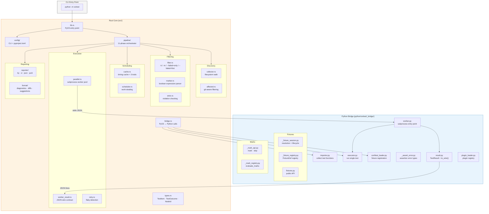
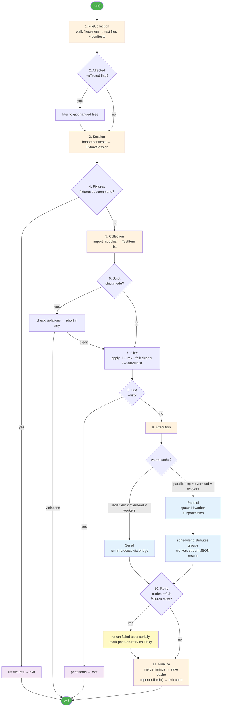

# Architecture

!!! abstract "Contributing"
    A map of oxitest's internal modules and pipeline execution order.

## Architecture layers

oxitest has two layers: a Rust core that orchestrates the full test pipeline, and a Python
bridge that handles module import and test execution. The layers communicate via PyO3
(in-process) and stdio JSON (parallel workers).

## Pipeline flow

The pipeline is a sequence of 11 phases, each implementing the `PipelinePhase` trait.
Phases can be conditionally skipped (`should_run`) and may exit early (`PhaseOutcome::Abort`).

**Parallel vs serial decision:**

- *Cold cache* (no timing data): run serially if collected test count is below `min_parallel_tests` (default: 100).
- *Warm cache* (timing data available): run serially if estimated total duration ≤ `spawn_overhead_ms × worker_count`.

When running in parallel, `src/parallel.rs` spawns subprocess workers (`python -m oxitest._bridge.worker`).
Each worker receives test groups over stdin as JSON, executes them, and streams results back over stdout
as JSON. The work-stealing scheduler in `src/scheduler.rs` distributes groups and collects results —
all in Rust, without GIL contention at the coordination layer.

## Module reference

| Module | File | Responsibility |
|--------|------|----------------|
| `lib` | `src/lib.rs` | Entry point — delegates to `pipeline::run()` |
| `pipeline` | `src/pipeline/` | Pipeline orchestrator (`mod.rs`): discovery → execution → cache update. Trait seams (`traits.rs`): `Session`, `ModuleCollector`, `TestRunner`, `ParallelRunner`. `ExecutionContext` bundles config/cache/session/conftest for the run phase. |
| `config` | `src/config/` | `mod.rs`: shared types + `Config` struct. `cli.rs`: CLI parsing (`clap`). `pyproject.rs`: TOML deserialization. |
| `collector` | `src/collector.rs` | File system walk: finds test files and conftest files |
| `bridge` | `src/bridge.rs` | PyO3 bridge: imports Python modules, collects `TestItem` list, runs individual tests. `_with_session_obj` variants take `Bound<'_, PyAny>`. |
| `types` | `src/types.rs` | Core data types: `TestItem`, `TestOutcome`, `OutcomeKind`, `NodeId`, `CollectError`, `TestTiming`, `Frame`, `FailureAccumulator` |
| `worker_result` | `src/worker_result.rs` | Worker subprocess JSON contract: `WorkerResult` (receive), `WorkerTask`/`WorkerTaskItem` (send) |
| `filter` | `src/filter.rs` | Keyword filtering, marker name validation, `--failed=only`/`--failed=first` logic, `group_by_module` |
| `marker` | `src/marker.rs` | Marker expression parser and evaluator (`and`/`or`/`not`) |
| `cache` | `src/cache.rs` | Timing cache: load/save `timings.json`, invalidation, duration estimation, `sort_groups` |
| `scheduler` | `src/scheduler.rs` | Work-stealing scheduler; preserves insertion order; cache pre-sorts groups by duration |
| `parallel` | `src/parallel.rs` | Subprocess worker pool: spawns `python -m oxitest._bridge.worker`, communicates over stdio JSON |
| `strict` | `src/strict.rs` | Strict-mode violation checking: bare asserts, dict parametrize, missing mark reason, unregistered markers |
| `reporter` | `src/reporter/` | Terminal output (`tty.rs`, `ci.rs`), JSON output (`json.rs`), plugin reporters (`plugin.rs`), exit codes (`exit.rs` + `ExitVote` enum), progress bars, timing summaries. Formatting in `format/` (diagnostics, summaries). |
